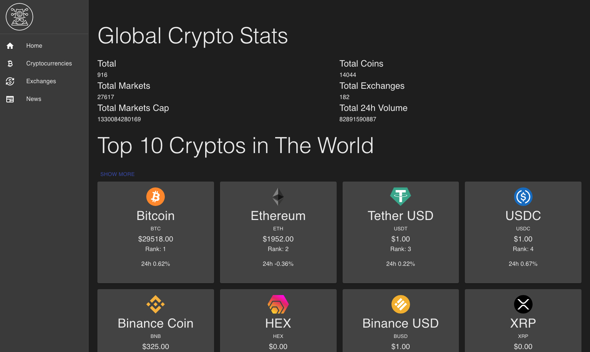

# Cryptocurrency Dashboard

A dashboard built with ReactJS and [D3.js](https://d3js.org/). The dashboard features information about the top cryptocurrencies by market cap, price, and volume. The data is pulled from [CoinGecko](https://www.coingecko.com/), [CoinRanking](https://coinranking.com/), and [Bing](https://www.bing.com/).

## Features

  * [D3.js](https://d3js.org/)
  * [ReactJS](https://reactjs.org/)
  * [MaterialUI](https://material-ui.com/)
  * [RapidAPI](https://rapidapi.com/)
  * [CoinGecko](https://www.coingecko.com/)
  * [CoinRanking](https://coinranking.com/)
  * [Bing](https://www.bing.com/)
## Installation

`git clone https://github.com/loveliiivelaugh/crypto-dashboard.git`

`cd crypto-dashboard`

Fill in your environment variables that you can get from RapidAPI

`npm install`

`npm start`

## Notes

There is a local custom hook that allows you to fetch all the crypto data at once and access it globally. Later I changed the architecture to fetch the data at the component level so that the data is refreshed everytime the component is rendered. However, the hook can be useful for additional development.

## Credits

[Twitter](https://twitter.com/loveliiivelaugh)

[Portfolio](https://michaelwoodward.dev)

[LinkedIn](https://www.linkedin.com/in/michaelanthonywoodward/)

Send some love 💛
0xe5F6BC85E03d7aC6819C97ac1dB1d2a237C05Edf

michaelwoodward.eth

## Inspiration

[Build and Deploy a React Cryptocurrency App](https://www.youtube.com/watch?v=9DDX3US3kss&t=133s)

*Except coded from scratch and used different libraries and architecture. Plus updated for React18*